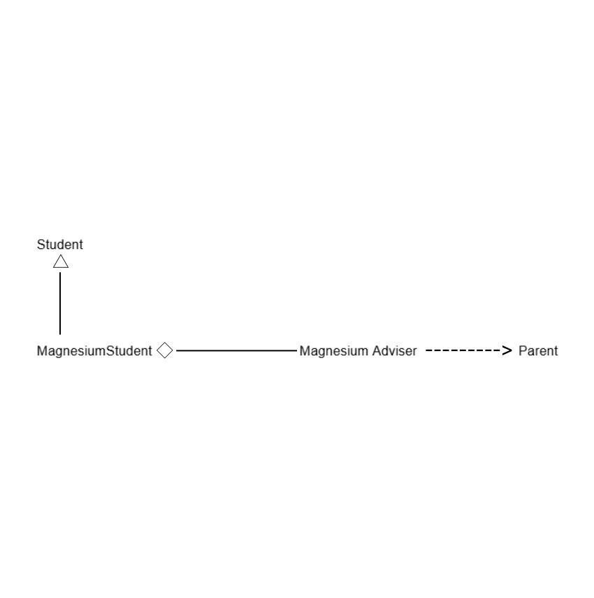
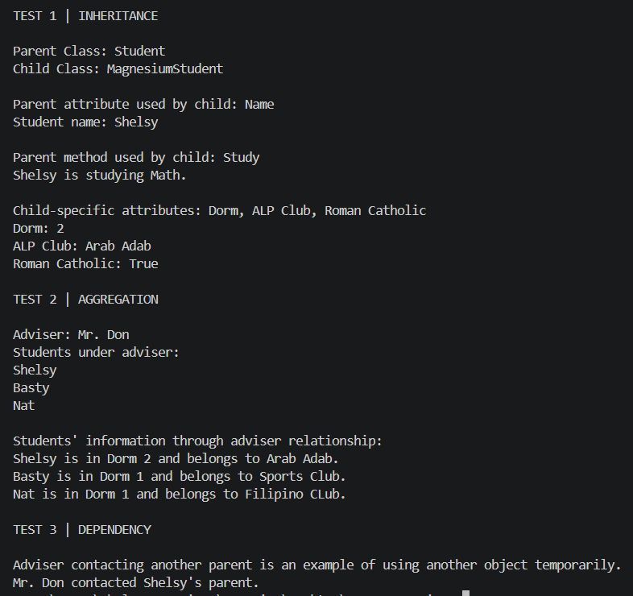
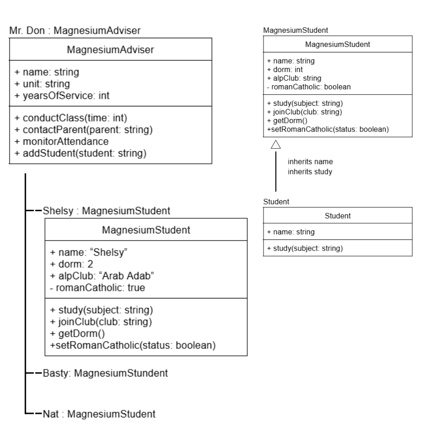

# Advanced Class Relationships
## Previous Activities
[classAttrib](classAttributesMethods.md)

[classRel](classRelationships.md)

## Existing System Description:

1. What classes currently exist in your system?

Class 1: MagnesiumStudent

Description: 
The MagnesiumStudent class serves as a blueprint for representing a student of 9 Magnesium for S.Y. 2026-2027. It defines the common attributes and behaviors that a 9 Magnesium student may have.

Class 2: MagnesiumAdviser

Description:
The MagnesiumAdviser class serves as a blueprint for representing the class adviser of 9 Magnesium for S.Y. 2026-2027. It defines the attributes and information that the 9 Magnesium adviser may have.

2. What problem or limitation exists in your current design?

My current design is limited, as it only establishes relationship between MagnesiumAdviser and MagnesiumStudent from the adviser's side. The adviser stores the students in a list, but each student does not have a direct reference to their adviser. This makes the relationship one-sided or partially represented in the system. This leads to problems such as the limited ability to access information about a student's adviser directly from a MagnesiumStudent object.

## Inheritance Relationship
Since MagnesiumAdviser and MagnesiumStudent do not have a parent-child relationship, I added another class, Student, to properly implement inheritance.

Parent Class: Student

Child Class: MagnesiumStudent

Why is the child a type of the parent?

MagnesiumStudent is a type of Student because a MagnesiumStudent is still a student who possessess the general characteristics and behavior of a student. The MagnesiumStudent class inherits the common attributes and methods of the Student class while adding its own attributes and behaviors specific to a 9-Magnesium student.

## Inheritance UML

## Composition/Aggregation
Class 1: MagnesiumStudent

Class 2: MagnesiumAdviser

Relationship: Aggregation (Weak HAS-A Relationship)

Explanation: 

MagnesiumStudent and MagnesiumAdviser have an aggregation relationship, meaning a weak HAS-A relationship. The MagnesiumAdviser has multiple MagnesiumStudent objects under their advisory. However, the students can still meaningfully exist independently of the adviser. For instance, if the adviser leaves the school, the students does not cease to exist. The students are created independently and are only added to the adviser's list through the addStudent() method. Thus, the adviser does not control the student's lifecycles, which makes aggregation more appropriate than composition.

## Advanced UML Diagram

## Python Implementation
[Source Code](advancedRelationships.py)

## Test Run

## Object Diagram

## Reflection
Answers:

1. Why did you choose your inheritance relationship? Explain why your child class is a type of your
parent class.

I chose the inheritance relationship between Student and MagnesiumStudent because a MagnesiumStudent is a specific type of Student. A MagnesiumStudent has the general attributes and methods of Student, such as having a name and being able to student, then adds properties and methods that are specific to students in 9-Magnesium.

2. How did inheritance reduce duplicate code? Identify attributes or methods that were reused.

Inheritance reduced duplicate code by allowing MagnesiumStudent to reuse the name attribute and study() method from the Student class. Instead of defining these features again in MagnesiumStudent, the child class uses super().__init__(name) to inherit the parent's initialization and directly uses the inherited study() method. 

3. Why is your HAS-A relationship Composition or Aggregation? Explain the lifecycle relationship
between the two objects.

The HAS-A relationship between MagnesiumAdviser and Magnesium student is aggregation because the students can exist independently of the adviser. The students are created separately from the MagnesiumAdviser object and are only added to the adviser's students list though the addStudent() method. Thus, if the adviser object is remoned, the student objects can still exist, which makes the association a weak HAS-A relationship.

4. What is the difference between Association from Part III and the advanced relationship you
implemented?

The association in OOPACT Part 3 only showed MagnesiumAdviser and MagnesiumStudent were related, without specifying a stronger type of relationship. Meanwhile, in Part 4, the realtionship between them is further identified as aggregation, which shows that the adviser has student objects while the students can still exist indepedently. 

5. How does your design follow the DRY principle?

My design follows the DRY (Don't Repeat Yourself) principle by placing common student attributes and methods in Student parent class and allowing MagnesiumStudent to inherit them. The name attribute and study() emthod only need to be defined once in the parent class instead of being duplicated in the child class, making the code more organized and concise.
