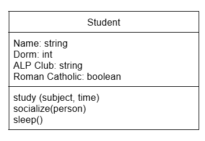
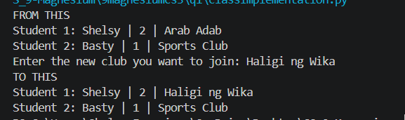
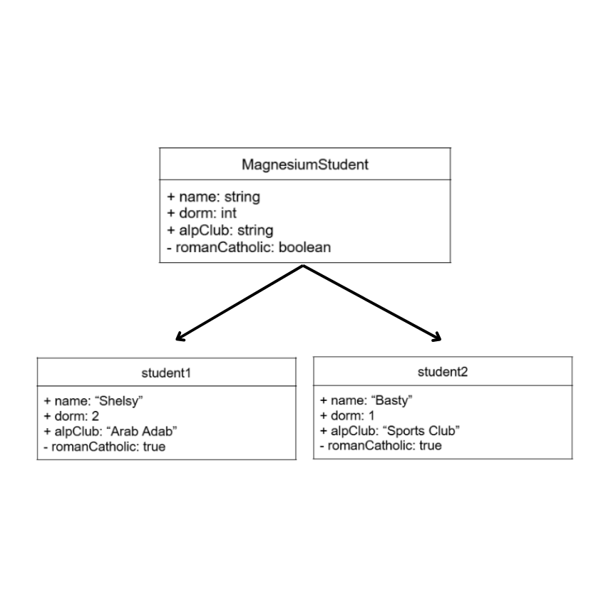

# Class Attributes and Methods

## Previous Design
Link to my previous activity:
[classObjectUML.md](classObjectUML.md)

## Design Revisions
- Class Name was changed from Student to 9MagnesiumStudent.
- Changed attribute names to camelCase
- Made romanCatholic a private attribute
- Removed the socialize(person) method
- Removed the sleep() method
- Added the joinClub(club: string) method
- Added the getDorm() method
- Added the setRomanCatholic(status: boolean) method
- Changed study(subject, time) to study(subject) by removing time parameter
- Added the parameter type string to study(subject)

## Visibility Decisions
| Attribute | Data Type | Visibility | Reason |
|---|---|---|---|
| Name | string | Public | Other classes may need to access the student's name |
| Dorm | int | Public  | Other classes may need to access student's dorm information |
| ALP Club | string | Public | Other classes may need to access the student's club information |
| Roman Catholic | boolean | Private | It is personal information that should not be directly accesssible by other classes |

## Updated UML Class Diagram

## Python Implementation
[View Python Source](classImplementation.py)

## Test Run

## Object Diagram

## Analysis

### Why did you make your chosen attribute private?

I made the religion attribute private because it contains personal information about a person's beliefs, customs, and practices. In addition, religion can be a sensitive topic for some people because everyone may have differnt beliefs and traditions. Thus, making this attribute private helps protecth the information and prevents it from being directly accessed or changes by other parts of the program.

### Which method changes the state of your object?

The joinClub(self, club) method changes the state of my object by replacing its original club with a new club. When a new club is passed as a parameter, the object's alpClub attrubute is updated to that new value.

### How did your two objects demonstrate that instances are independent?

My two objects, student1 and student2 demonstrated that instances are independent because each object has its own set of attributes and values encapsualted within them. For instance, student1 and student2 have different names, dorm numbers, and clubs. When I called the joinClub(self, club) method on student1, only student1's club was changes, while student2's club remained the same. 

### What is the difference between your class diagram and your object diagram?

The class diagram represents the blueprint of the MagnesiumStudent class. It shows the attributes, their data types and visibility, as well as the methods that the class can perform. Meanwhile, object diagram shows the actual instances created from the class, such as student1 and student2, along with their specific properties. 