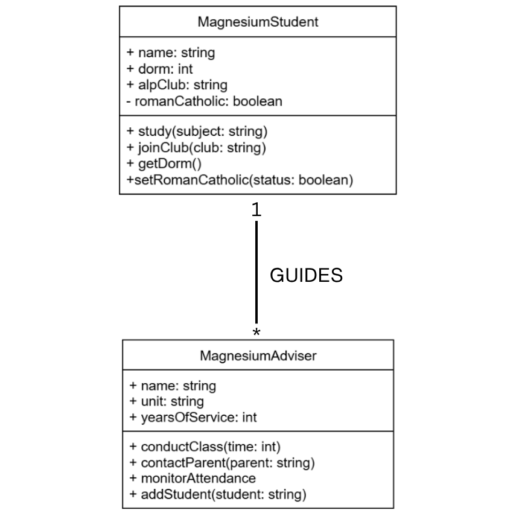
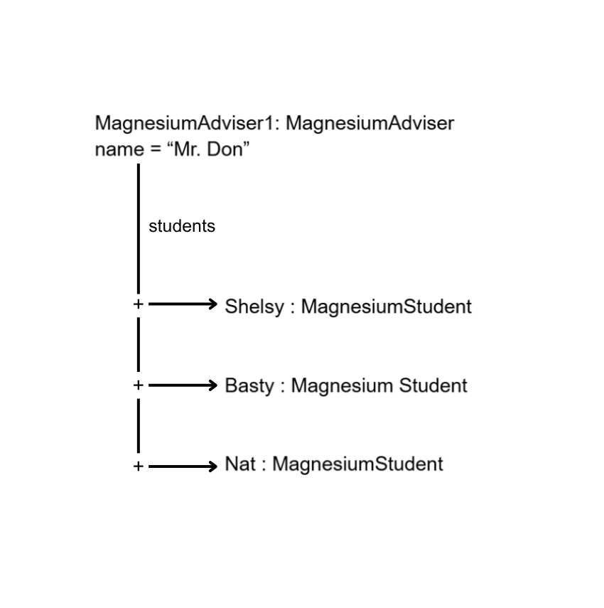

# Class Relationships: Association and Multiplicity
## Previous Work
[Part I - Classes and Objects](classObjectUML.md)

[Part II - Class Attributes and Methods](classAttributesMethods.md)

## Existing Class
Class: MagnesiumStudent

Description: 
The MagnesiumStudent class serves as a blueprint for representing a student of 9 Magnesium for S.Y. 2026-2027. It defines the common attributes and behaviors that a 9 Magnesium student may have.

## New Related Class
Class: MagnesiumAdviser

Description:
The MagnesiumAdviser class serves as a blueprint for representing the class adviser of 9 Magnesium for S.Y. 2026-2027. It defines the attributes and information that the 9 Magnesium adviser may have.

## Association
Relationship: HAS-A relationship (ADVISER GUIDES STUDENTS)

Explanation: 
The association is HAS-A relationship because their lifecycles are independent of each other. For instance, if the adviser leaves the school, the students does not cease to exist. In addition, there is no strict ownership between them. They are merely entities that are associated for a period of time, but does not strictly own or destroy one another.

## Multiplicity
Multiplicity: One-to-Many (Adviser-----* 9MagnesiumStudent)

Explanation:
The multiplicity is One-to-Many because only one adviser is assigned to multiple students.

## UML Class Relationship Diagram   

## Python Implementation
[View Python Source](images-oopact3/classRelationships.py)

## Test Run

## Object Relationship Diagram

## Analysis
### What is the association between your two classes?

The association between my classes is HAS-A relationship, which indicates that the two classes are related entities, but they do not have a strict ownership relationship.

### What multiplicity did you choose and why?

I chose a multiplicity of One-to-Many (Adviser-----* 9MagnesiumStudent). I chose it because in schools, only one adviser is assigned to a class, which composes of many students.

### How did you implement the relationship in Python?

I implemented the relationship by giving the MagnesiumAdviser class a list called students. Then, I created an addStudent() method that adds each MagnesiumStudent object to this list. After, I created one adviser object and three student subjects and used addStudent() to connect the students to the adviser. To access and display the information of the students through the adviser, I used a for loop.

### Why did you store an object reference instead of copying?

I stored an object reference instead of copying to ensure that the adviser is connected to the actual MagnesiumStudent objects. This means that the adviser is allowed to access the students' attributed and information directly through the relationship. If not done this way, the relationship would only contain separate pieces of information instead of actual connections between the objects.
