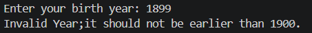
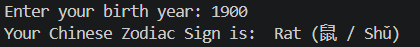
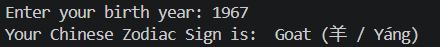
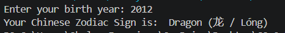

# Chinese Zodiac

**Name:** Shelsy Sanchez Francisco

**Section:** 9 Magnesium

**Last Name:** Francisco

**Date:** August 18, 2026

## Requirements

a. Ask the user to enter a year of birth. The baseline year 1900.

b. Validate user input that it should not be earlier than 1900.

c. If the user enters an invalid year then display an appropriate message then stop or abort the program.

d. Otherwise determine the chinese zodiac sign based on the following starting from 1900.  

Note: A zodiac sign will recur after each 12 years.

e. CONSIDER only the year of birth.

Example input and output:

Enter your birth year: 2000

Your Chinese Zodiac Sign is: Dragon (龙 / Lóng)


## Code
```python
zodiac = [
    "Rat (鼠 / Shǔ)",
    "Ox (牛 / Niú)",
    "Tiger (虎 / Hǔ)",
    "Rabbit (兔 / Tù)",
    "Dragon (龙 / Lóng)",
    "Snake (蛇 / Shé)",
    "Horse (马 / Mǎ)",
    "Goat (羊 / Yáng)",
    "Monkey (猴 / Hóu)",
    "Rooster (鸡 / Jī)",
    "Dog (狗 / Gǒu)",
    "Pig (猪 / Zhū)"
]

birth_year = int(input("Enter your birth year: "))

if birth_year < 1900:
    print("Invalid Year;it should not be earlier than 1900.")
else:
    i = (birth_year - 1900) % 12
    print("Your Chinese Zodiac Sign is: ", zodiac[i])
```

## Output




